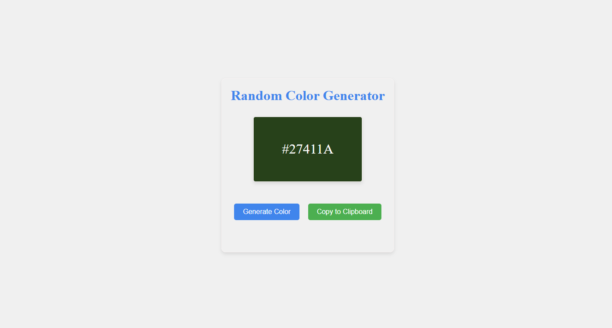

# Day-4-Color-Generator

A simple and interactive Random Color Generator built using HTML, CSS, and JavaScript.

Click the button to generate a random HEX color. The color box updates instantly, and the generated color code is displayed on the screen. You can also copy the color code to your clipboard.
🚀 Features

🎨 Generates a random HEX color

🖌 Updates the color preview box dynamically

📝 Displays the generated HEX code

📋 Copy to clipboard functionality

💡 Clean and responsive UI

🛠️ Technologies Used

HTML5

CSS3

JavaScript
